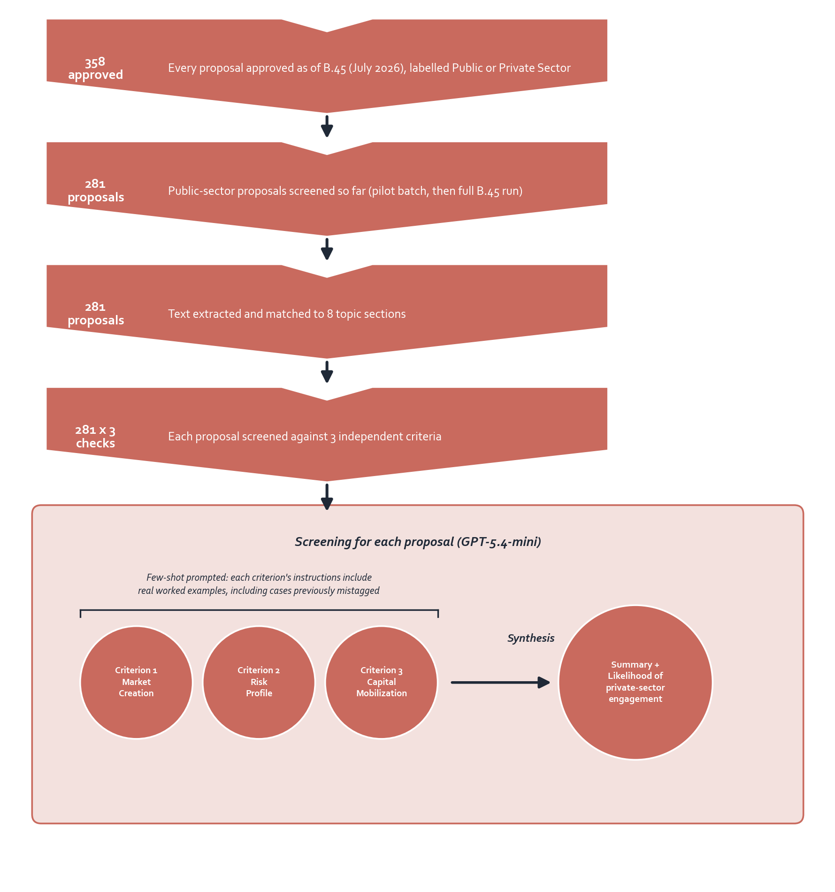
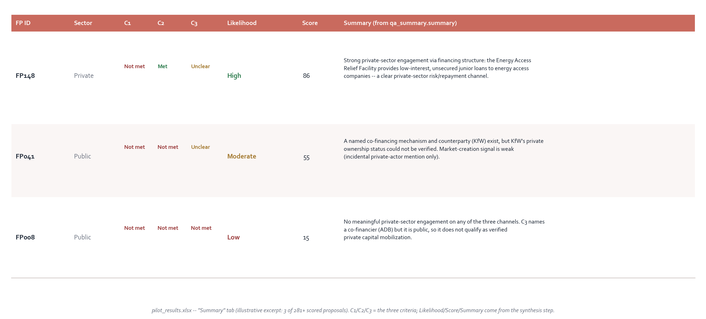

# PSF Universe Tagging

AI-assisted screening of GCF funding proposals for private-sector engagement,
using GPT-5.4-mini on the GCF IEU Azure AI Foundry endpoint. Built to help
identify private-sector nature/components within public-sector-labelled
proposals, beyond GCF's own current Public/Private Sector Facility (PSF)
labelling, not to replace it.

## Why this exists

GCF tags every approved proposal Public or Private Sector at approval, but that
single label can miss private-sector engagement embedded *within* a
public-sector proposal, e.g. a public-sector grant that funds a named blended
finance facility, or a co-financing structure with a private counterparty.
This pipeline screens the full text of each proposal against three
independent, evidence-grounded criteria to surface that engagement wherever it
appears, whatever the proposal's headline label.

## Workflow

*Every proposal approved as of GCF's Board meeting B.45 (July 2026, 358 total)
is labelled Public or Private Sector. This pipeline has screened all 281
Public-sector proposals to date (an initial 15-proposal pilot, then the
remaining Public-sector portfolio) against three independent criteria, each
judged by its own focused model call rather than one combined prompt, then
synthesized into a single per-proposal summary.*

## The three criteria

Each criterion is judged by its own prompt (`prompts/`), each a decision
table + worked examples + strict JSON schema, so any one criterion can be
recalibrated without disturbing the other two:

| Criterion | File | Question |
|---|---|---|
| 1. Market creation | `prompts/criterion_1_market_creation.md` | Does the project intentionally build up a local private actor (an MSME, local bank, climate-tech firm, etc.) as its own named component or output, not just a passing mention? |
| 2. Risk profile | `prompts/criterion_2_risk_profile.md` | Does GCF's own financing carry a private-sector-like function (loan, equity, guarantee, first-loss), or does it fund a specifically named private-sector financing mechanism, rather than being a plain grant with no repayment or risk-sharing role? |
| 3. Verified capital mobilization | `prompts/criterion_3_capital_mobilization.md` | Is there a named mechanism (co-financing, guarantee, etc.) paired with a counterparty confirmed private against a structured ownership list? Deliberately strict: an earlier, looser version of this rule marked effectively every sampled project "met" just for naming any co-financier, public or private. |

A fourth call (`prompts/synthesis_qa_summary.md`) reads only the three
already-computed criterion results, not the source document, and reasons
across them into one overall judgment: an `overall_likelihood`
(high/moderate/low), a plain-language summary, the named entities involved,
and any flags a human reviewer should double-check.

**Design principle: independent signals, not a checklist.** A proposal counts
as private-sector relevant if *any single* criterion shows strong evidence on
its own terms, not only when all three agree. The final PSF judgment still
rests on synthesis across all three, but no criterion is required to pass for
another to count.

**Quote-grounding.** Every status in every criterion must be backed by a
verbatim quote copied from the proposal text, this is the core auditability
mechanism: a reviewer can always trace a verdict back to the exact sentence
that produced it, whatever the model's exact wording turns out to be on a
given run (see `SPEC.md` on determinism).

## Model spec

See [`SPEC.md`](SPEC.md) for the exact model, endpoint, call parameters
(temperature, reasoning effort, token limits), and the reliability work done
to eliminate truncated-reply failures at scale.

## Code

`src/` contains the full pipeline, in the order it runs:

| Step | Script | What it does |
|---|---|---|
| 1 | `load_from_gcf_json.py` / `extract_text.py` | Get proposal text, either from a pre-scraped GCF documents database or by extracting it from a PDF (PyMuPDF). |
| 2 | `chunk_fp.py` | Match the text to ~8 named FP-template sections by topic wording (GCF has used at least three different template layouts over time, so this never anchors on a fixed section number or letter). |
| 3 | `build_evidence_packet.py` | Combine the matched sections with any structured metadata on hand (sector, instrument type, entity-ownership reference) into one evidence packet per proposal. |
| 4 | `config.py` / `score_project.py` / `foundry_client.py` | Fill each criterion's prompt template and call the model. |
| 5 | `run_pilot.py` | Orchestrates steps 1-4 across a batch of proposals; re-run-safe (skips already-scored rows; `--criteria` re-scores just one criterion; `--force` redoes everything). |
| 6 | `synthesize_summary.py` | The fourth, cross-criterion synthesis call. |
| 7 | `export_to_excel.py` | Rebuilds a reviewable Excel workbook from the JSON results every time it's run. |

## Output

`run_pilot.py` writes one JSON object per proposal (`criterion_1_...`,
`criterion_2_...`, `criterion_3_...`, each with `status`, a verbatim `quote`,
`evidence_strength`, and a `justification`), `synthesize_summary.py` adds a
`qa_summary` block on top. `export_to_excel.py` turns that into a workbook
with a Summary tab (one row per proposal) and an Entities Unmatched tab (every
named counterparty the pipeline couldn't verify against a known
public/private ownership list, for fast human lookup).

The actual result files (`pilot_results.jsonl` / `.xlsx`) are not published in
this repo, this is still a pilot, not a finalized dataset. Below is an
illustrative excerpt (3 of 281 scored proposals) showing the output shape:

